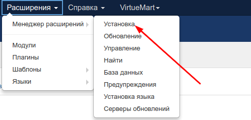
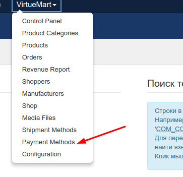
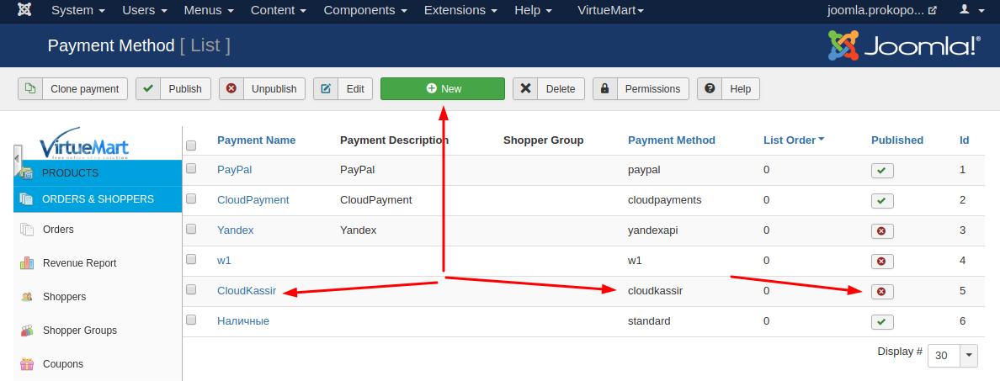
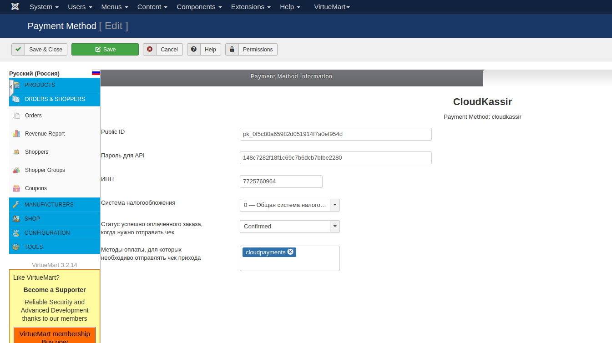

# CloudKassir модуль для Joomla - VirtueMart
Модуль позволяет интегрировать онлайн-кассу [CloudKassir](https://cloudkassir.ru/) в интернет-магазин на платформе Joomla - VirtueMart.

### Совместимость:
* Joomla v.3.x;
* VirtueMart v.3.x.

_Если вы используете платежный модуль CloudPayments совместно с модулем CloudKassir, то убедитесь, что в платежном модуле отключена отправка чеков через онлайн-кассу, во избежание дублирования кассовых чеков._  

Модуль тестировался на VirtueMart = 3.2.12 (Joomla >= 3.8.4)

### Возможности:    
• Поддержка онлайн-касс (ФЗ-54);  
• Автоматическая отправка чеков прихода по email и SMS;  
• Отправка чеков возврата по email и SMS;  

#### Установка через панель управления

В панели адмниистратора зайти в раздел "Расширения/Менеджер расширений/Установка" и загрузить архив.

### Ручная установка

Распаковать из архива каталог cloudkasir и загрузить в папку plugins/vmpayment.

!!! Скопируйте файл paymentmethods.php в директорию administrator/components/com_virtuemart/fields

### Настройка модуля

1. Перейдите в раздел "VirtueMart/Payment Methods". Создайте способ оплаты "CloudKassir" и укажите все необходимые настройки  
  
  
  
!!! Внимание !!! Payment Method обязательно должен называться "cloudkassir"
Не публикуйте молуль, в противном случае он появится в списке возмоных способов для оплаты.
Он не является платёжным, но т.к. VirtueMart не предусматривает ФЗ-54, то это единственный удобный вариант для размещения подобного модуля.

### Настройка вебхуков
Для корректной настройки вебхуков откройте ссылку по адресу  
`http://yoursite.ru/index.php?option=com_virtuemart&view=pluginresponse&task=pluginresponsereceived&cloudpayments_receipt`

В некоторых случаях, в частности использовании нескольких языков для посетителей сайта, ссылка может видоизмениться. Например так.  
`http://yoursite.ru/ru/?option=com_virtuemart&view=pluginresponse&task=pluginresponsereceived&cloudpayments_receipt`

Данную ссылку и необходимо будет указывать в вебхуках.

* (уведомлений о кассовых чеках)  
`index.php?option=com_virtuemart&view=pluginresponse&task=pluginresponsereceived&cloudpayments_receipt`
